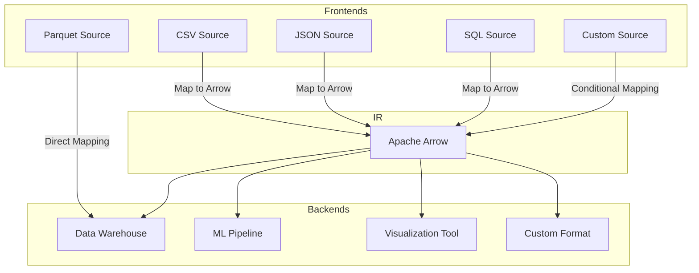

<div align="center">

# evolve-py
##### A highly efficient, composable, and lightweight ETL framework, Apache Arrow native.

</div>

> [!IMPORTANT]
> THIS IS CURRENTLY AN EXPERIMENTAL LIBRARY AND UNDERGOES BREAKING CHANGES
> ON A DAILY BASIS. SOON™ evolve WILL BE STABLE AND PROD READY TO USE
> FOR ALL YOUR ETL NEEDS, not all needs (scheduling, job dependency, etc.)
> but this is planned to be solved with another program (firelink!)

NATIVE SUPPORT FOR **firelink** scheduler.

What is **firelink**? A highly efficient, platform agnostic, and lightweight job scheduler. (WIP)! [link](https://github.com/firelink-sh/firelink)


## Project outline/brainstorming

What is `evolve`?

One-size fits-all framework for taking data from format A to format B and
applying optional transforms T.

High-performance data processing with Arrow:

- **Columnar memory format**
- **Zero-Copy data sharing**
- **Vectorized operations**
- **Memory efficiency**
- **Compatibility with big-data technology**




Why?
- EL(T) is difficult, costly, without clear standards/frameworks it rapidly becomes messy.
- no "lowcode"/UI/drag and drop shit, made for real data engineers, not business managers
- no vendor lock-in. easy to audit, extend, and run wherever.
- standardized interface/framework - custom logic
- arrow native
  - fast in-memory operations (perfect for OLAP)
  - easy interoperability with DuckDB, Pandas, Polars, Spark, etc.
  - Potential for streaming, GPU acceleration, real-time analytics.
- deployment agnostic (NO LOCK-IN)!!!! YOU RUN IT HOW YOU WANT TO - I COULDN'T CARE LESS
- community potential :)

This is not a replacement for Fivetran or Airbyte - we are offering a **developer-first alternative**
- lightweight
- transparent
- extensible
- free
- high performant

There is no reason to reinvent the wheel for your ETL needs - use evolve!

It might look something like this:

```python
import evolve as ev

from evolve.source import PostgresSource
from evolve.target import Parquet
from evolve.transform import DropNulls

# Pipelines are lazy - only run when told to
pipeline = ev.Pipeline("ingress") \
    .with_source(PostgresSource(...)) \
    .with_target(Parquet(...)) \
    .with_transform(DropNulls(columns=(..., ))

pipeline.run()  # runs the ELT
```


You can configure it with yaml/json/toml!

```yml
source:
  type: postgres
  host: localhost
  db: prod
  user: admin
  password: secret
  schema: sales
  tables: orders

transforms:
  - type: drop_nulls
    columns: ["order_id", "amount"]
  - type: rename_columns
    mapping:
      order_id: id
      amount: total
  - type: filter_rows
    condition: "total > 100"

target:
  type: parquet
  path: s3://prod/sales/orders.parquet
```

```json
{
  "source": {
    ...
  },
  "transforms": {
    ...
  },
  "target": {
    ...
  }
}
```


## Roadmap

### Phase 1: MVP Foundation

**Goal:** build a minimal, working ELT pipeline with Arrow as the backbone.

Core features:
- [x] `Pipeline` class with source -> transforms -> target
- [x] Apache Arrow integration (pyarrow.Table)
- [x] Basic source connectors: PostgreSQL, CSV, Parquet
- [x] Basic target connectors: PostgreSQL, CSV, Parquet
- [x] Transform functions: `cast_to`, `drop_nulls`, `rename_columns`, `filter_rows`
- [x] YAML & JSON config support
- [x] Config loader and pipeline builder

Dev experience:
- [ ] logging and error handling
- [x] sample config files and datasets (examples)
- [x] github repo public with readme and licensing


### Phase 2: Usability & Extensibility

**Goal:** make evolve easy to use, extend, and deploy.

Features:
- [ ] cli tool (`evolve run config.yml`)
- [ ] plugin system for connectors and transforms
- [ ] schema validation and drift detection
- [ ] arrow schema inspection utilities
- [ ] retry and failure handling

Packaging:
- [ ] Publish to PyPI (`pip install evolve-py`)
- [ ] Dockerfile for containerized usage
- [ ] Basic docs site (e.g., GitHub pages or Read The Docs)


### For the future

- [ ] Config encryption
- [ ] metrics and observability hooks
- [ ] parallel extraction and loading
- [ ] streaming mode (Kafka -> Arrow -> Target)
- [ ] Arrow Flight for distributed transport
- [ ] Native support when source = target (no pulling out data unnecessarily).
- [ ] Incremental sync support (CDC or timestamp-based)
- [ ] More sources and targets


## ETL internal representation considerations

What internal representation should we have?

Arrow Tables vs Polars DataFrames

We are not that compute heavy - mostly I/O bound moving data
from place A to place B, with optional transforms on the single
data sources.

**Arrow Tables** are rock-solid, zero-copy *interchange* format
with a fairly low-level API; **Polars DataFrames** are a high-level,
optimized *compute* engine (built on Arrow memory) with a great UX
for transformations. For a fully fletched ETL framework, standard
is to use **Polars for transforms** and **Arrow at the boundaries** (I/O, interchange).

## PyArrow Tables

- Strengths
    - Standard interchange: everything talks Arrow.
    - Immutable columnar: predictable memory layout, great for scanning.
    - Streaming and chunked data: streaming IPC, good for large incremental pipelines,
    - Stable spec: long-term compatibility guarantees.

- Trade-offs
    - Ergonomics: transform API is low-level; complex transforms become verbose
    - Feature velocity: fewer 'batteries included' for joins/windows functions,
    - Mutations: tables are immutable, many ops create new array/tables - clunky for iterative transforms

## Polars DataFrame

- Strengths
    - Excellent transform UX: expressive *lazy* API with optimizer (predicate/projection pushdown, join reordering, etc.)
    - Performance: multi-threaded Rust engine; very fast group-bys/joins/window ops; good string/date/time-tooling
    - Memory behaviour: columnar, Arrow-backed buffers, copy-on-write (CoW) semantics minimize actual copying in common cases,
    - Interoperability: zero-copy to/from Arrow in many cases.

- Trade-offs
    - UDFs: Python UDFs break optimization and can be slower,
    - Ecosystem: very healthy, but Arrow is still the 'lingua franca' when integrating with everything under the sun.

## Architecture recommendation

A hybrid approach! :)

1. Sources (Frontends)
    - Read using Arrow readers.
    - Convert **zero-copy** into Polars as IR.
2. Transforms (IR modification)
    - Build the transform graph in Polars (lazy).
3. Targets (Backends)
    - Emit Arrow (`df.to_arrow()`)

