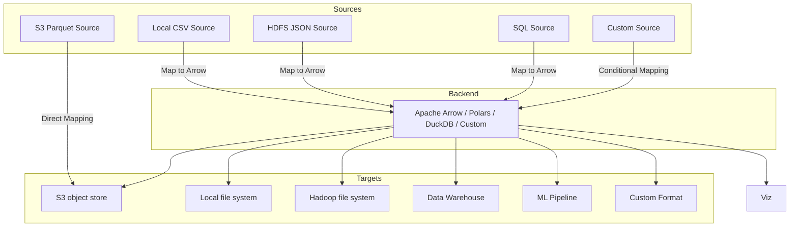

<div align="center">

# evolve
##### A highly efficient, composable, and lightweight ETL framework, Apache Arrow native.

</div>

What is `evolve`?

A platform agnostic Python framework for building composable, memory-efficient,
and blazing fast ETL and ingress jobs.

It is built for real data engineers - no low-code/click-ops/drag-and-drop shenanigans -
offering you full control of how data is read/loaded, parsed, stored in-memory,
transformed, and written to a large sets of data targets.

Essentially `evolve` is a high-performance data processing framework
enabled through the Apache Arrow specification:

- **Columnar memory format**
- **Zero-Copy data sharing**
- **Vectorized operations**
- **Memory efficiency**
- **Compatibility with big-data technology**




Why?
- Ingress and ETL/ELT is for some reason difficult for organizations to manage,
    costly, without clear standards/frameworks it rapidly becomes messy.
- no "lowcode"/UI/drag and drop shit, made for real data engineers, not business managers
- no vendor lock-in. easy to audit, extend, and run wherever.
- standardized interface/framework - custom logic
- arrow native
  - fast in-memory operations (perfect for OLAP)
  - easy interoperability with DuckDB, Pandas, Polars, Spark, etc.
  - Potential for streaming, GPU acceleration, real-time analytics.
- deployment agnostic (NO LOCK-IN)!!!! YOU RUN IT HOW YOU WANT TO - I COULDN'T CARE LESS
- community potential :)

This is not a replacement for Fivetran or Airbyte - we are offering a **developer-first alternative**
- lightweight
- transparent
- extensible
- free
- high performant

There is no reason to reinvent the wheel for your ETL needs - use evolve!


## Example usage

```python
from evolve import Pipeline
from evolve.source import PostgresSource
from evolve.target import ParquetTarget
from evolve.transform import DropNulls

# Pipelines are lazy - only run when told to
pipeline = Pipeline("ingress") \
    .with_source(PostgresSource(...)) \
    .with_target(ParquetTarget(...)) \
    .with_transform(DropNulls(columns=(..., ))

pipeline.run()  # runs the ETL
```

You can configure it with yaml/json/toml!

```yml
source:
  type: postgres
  host: localhost
  db: prod
  user: admin
  password: secret
  schema: sales
  tables: orders

transforms:
  - type: drop_nulls
    columns: ["order_id", "amount"]
  - type: rename_columns
    mapping:
      order_id: id
      amount: total
  - type: filter_rows
    condition: "total > 100"

target:
  type: parquet
  path: s3://prod/sales/orders.parquet
```

```json
{
  "source": {
    ...
  },
  "transforms": {
    ...
  },
  "target": {
    ...
  }
}
```
