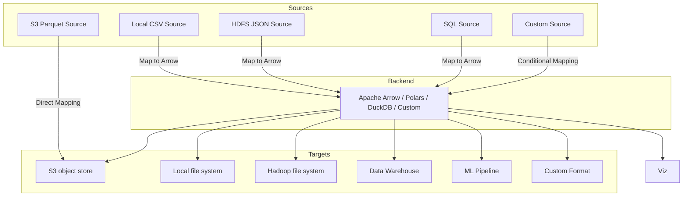

<div align="center">


<p>
    <em>A highly efficient, composable, and lightweight ETL and data integration framework</em>
</p>

<br>

[](https://github.com/firelink-sh/evolve/actions/workflows/ci.yml)
[](https://github.com/firelink-sh/evolve-py/actions/workflows/tests.yml)
[](https://codecov.io/gh/firelink-sh/evolve-py)

<br>

</div>

evolve is an **open-source** and **platform agnostic** Python framework that enables your data teams to **efficiently integrate data** from a wide variety of **structured** or **unstructured** data sources into your **database**, **data warehouse**, or **data lake(house)** — **blazingly fast** with **minimal memory overhead** thanks to Apache Arrow. 

It is **built for developers** with a **code-first** mindset. You will not find any low-code, clickops, or drag-and-drop shenanigans here.
evolve offers you full control of how your data is read, parsed, handled in-memory, transformed, and finally written to any destination you need.

- **Composable** - Design your own data pipelines to fit into your own stack, and add any extra (possibly proprietary) sources or targets that you might possibly need, all possible through evolve's intuitive and lightweight framework philosophy.
- **Blazing fast** - Zero-copy principles by leveraging Apache Arrow gives you extremely rapid in-memory operations perfect for OLAP and easy interoperability with DuckDB, Polars, Spark, DataFusion and many more query engines.
- **Customizable** - You choose the backend that you want to use. Do you prefer DataFrames? Use Polars! Or perhaps you prefer to work on data using SQL? Then use the DuckDB backend! It is completely up to you.
- **Platform agnostic** - Run your ETL/ELT using evolve on your own infrastructure, no vendor lock-in, never.


## Architecture (alpha version)




## Why evolve?

- Ingress and ETL/ELT is for some reason difficult for organizations to manage,
    costly, without clear standards/frameworks it rapidly becomes messy.
- no "lowcode"/UI/drag and drop shit, made for real data engineers, not business managers
- no vendor lock-in. easy to audit, extend, and run wherever.
- standardized interface/framework - custom logic
- arrow native
  - fast in-memory operations (perfect for OLAP)
  - easy interoperability with DuckDB, Pandas, Polars, Spark, etc.
  - Potential for streaming, GPU acceleration, real-time analytics.
- deployment agnostic (NO LOCK-IN)!!!! YOU RUN IT HOW YOU WANT TO - I COULDN'T CARE LESS
- community potential :)

This is not a replacement for Fivetran or Airbyte - we are offering a **developer-first alternative**
- lightweight
- transparent
- extensible
- free
- high performant

There is no reason to reinvent the wheel for your ETL needs - use evolve!


## Example usage

```python
from evolve import Pipeline
from evolve.source import PostgresSource
from evolve.target import ParquetTarget
from evolve.transform import DropNulls

# Pipelines are lazy - only run when told to
pipeline = Pipeline("ingress") \
    .with_source(PostgresSource(...)) \
    .with_target(ParquetTarget(...)) \
    .with_transform(DropNulls(columns=(..., ))

pipeline.run()  # runs the ETL
```

You can configure it with yaml or json!

```yml
source:
  type: postgres
  host: localhost
  db: prod
  user: admin
  password: secret
  schema: sales
  tables: orders

transforms:
  - type: drop_nulls
    columns: ["order_id", "amount"]
  - type: rename_columns
    mapping:
      order_id: id
      amount: total
  - type: filter_rows
    condition: "total > 100"

target:
  type: parquet
  path: s3://prod/sales/orders.parquet
```


## License

evolve is distributed under the terms of both the MIT License and the Apache License (version 2.0).

See LICENSE-APACHE and LICENSE-MIT for details.
